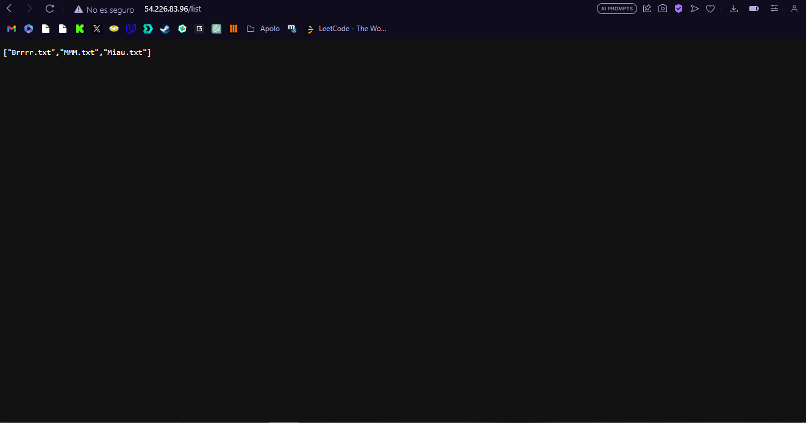
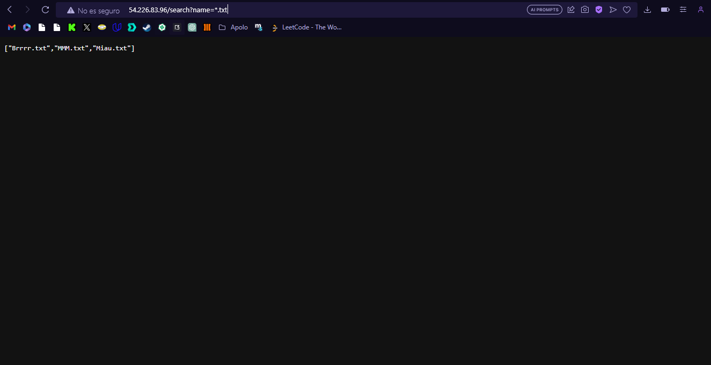
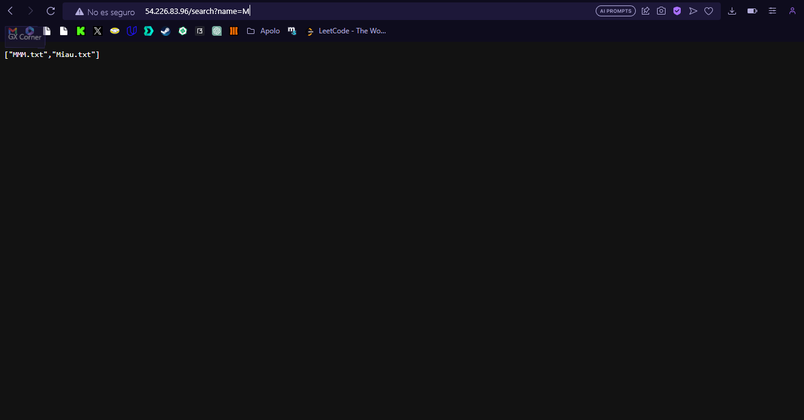
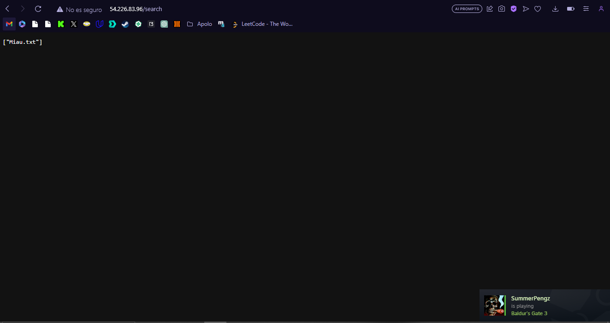
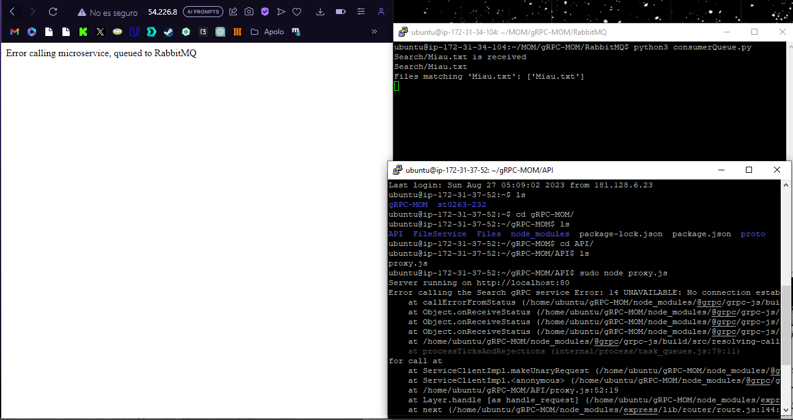
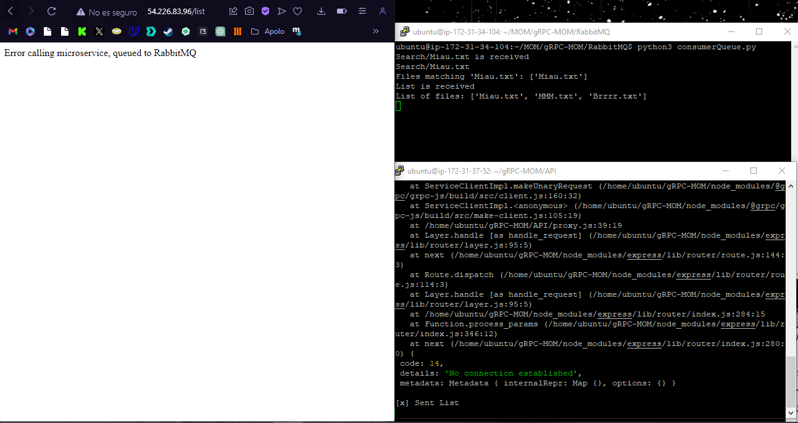

# info de la materia: ST0263 Topicos especiales en telematia
#
# Estudiante(s): Esteban Bernal Correa, ebernalc@eafit.edu.co
#
# Profesor: Edwin Nelson Montoya, emontoya@eafit.edu.co
#

# Reto 2
#
# 1. Implementacion de 2 microservicion en gRPC y MOM (en caso de fallo del gRPC)
#
<texto descriptivo>

## 1.1. En este reto cumpli la implementacion de ambos microservicion con gRPC el cual se comunica con un API Gw, y dependiendo de los parametros enviados se llama uno de los dos microservicios. Tambien se implemento MOM en el case de fallo de la comunicacion con gRPC.

## 1.2. Tener las 2 colas en MOM, una con el mensaje y la segunda con el identificador de el enviador.

# 2. Se tienen 3 instancias. El API gateway, el cual es el que se encarga de comunicarse con el servidor gRPC y en caso de fallo mandar a la cola al servidor mom. El servidor gRPC, el cual tiene el codigo de ambos microservicios y esta constantemente escucnado en el puerto 50051. Y por ultimo esta el servidor MOM, el cual tiene el contenedor de docker en donde se encolan los mensajes, y el consumer queue, el cual los desencola.

# 3. La mayoria de el proyecto esta en node.js. Para el codigo de el API utilize js, con la libreria express. En el server gRPC utilize js, con la libreria gRPC, fast-glob y proto loader. Y para el MOM utilize docker para crear un contenedor de RabbitMQ. Para el consumer queue, utilize python con pika y glob.

# Resumen de Servicios

## Listar Archivos: Lista todos los archivos en el directorio especificado.

## Buscar Archivos: Busca archivos en el directorio basándose en un patrón dado.

# Instancias:

# API Gateway: 54.226.83.96

## En esta instancia de sebera correr el codigo proxy.js

## sudo node proxy.js

# Servicio gRPC: 107.21.98.242

## En esta instancia deberia de correr el codigo Server.js

## sudo node Server.js

# RabbitMQ (MOM): 44.214.98.62

## En esta instancia se debe de levantar el contenedor y correr el codigo para desencolar los mensajes y traducirlos.

## sudo docker start rabbit-server

## python3 consumerQueue.py

# Cómo Usar

# Listar Archivos:

## Para listar todos los archivos, realiza una solicitud a:

## http://54.226.83.96/list

# Buscar Archivos

## Para buscar archivos, realiza una solicitud GET con el patrón de búsqueda deseado como parámetro de consulta:

## http://54.226.83.96/search?name=<PATRON_DE_BUSQUEDA>

## Reemplaza <PATRON_DE_BUSQUEDA> con el patrón que deseas buscar.

# Manejo de Errores:

## Si el servicio gRPC está inactivo cuando se realiza una solicitud a través del API Gateway, la solicitud será enviada a RabbitMQ.

# 4. Si se quiere ejecutar en su propia maquina debe de hacer lo siguiente. 

## Clonar este repositiorio

## Habilitar los puertos a usar en el security group (esto solo si estas en AWS) 

## Puertos: 50051, 80, 5672, 15672.

## Installar node y usar npm i para installar todas las dependencias del projecto

## Instalar python y pika

## Installar docker y crear el contenedor

## Crear una cola my_app y un exchange my_exchange en RabbitMQ, bindearlos

## Cambiar las ips de los codigos a las ips de tu maquina

## Correr los codigos como fue descrito anteriormente

 
 
 
 

# referencias:
<debemos siempre reconocer los créditos de partes del código que reutilizaremos, así como referencias a youtube, o referencias bibliográficas utilizadas para desarrollar el proyecto o la actividad>

## Este proyecto fue basado en el laboratorio propuesto por este repositorio.
## https://github.com/st0263eafit/st0263-232/tree/main

#### versión README.md -> 1.0 (2023-agosto-28)